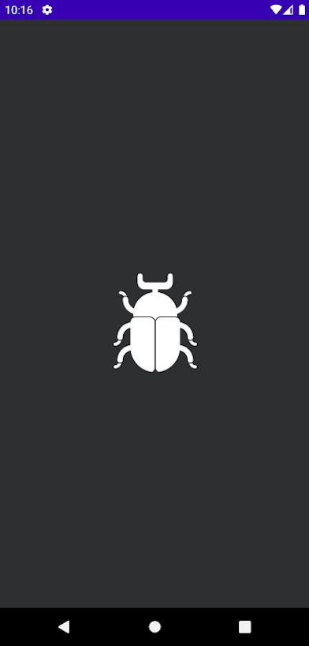

Auto App Distribution
===================
_(in the process)_


### Target

* Configure service [Firebase App Distribution](https://firebase.google.com/docs/app-distribution) for AAB.
* Add the ability to centrally change testers.
* Automatic provisioning of **releaseNotes** based on git commits.

### Architecture

* MVVM - [Guide to app architecture](https://developer.android.com/jetpack/guide)
* Gradle - [Kotlin DSL](https://docs.gradle.org/current/userguide/kotlin_dsl.html)
* Toolkit - [Jetpack Compose](https://developer.android.com/jetpack/compose)
* Distribution - [Firebase App Distribution](https://firebase.google.com/docs/app-distribution)
* Animation - [Lottie for Android](http://airbnb.io/lottie/#/android-compose)

### Preview
<p>


</p>

# License

```
Copyright 2021 Vitaliy Zarubin

Licensed under the Apache License, Version 2.0 (the "License");
you may not use this file except in compliance with the License.
You may obtain a copy of the License at

    http://www.apache.org/licenses/LICENSE-2.0

Unless required by applicable law or agreed to in writing, software
distributed under the License is distributed on an "AS IS" BASIS,
WITHOUT WARRANTIES OR CONDITIONS OF ANY KIND, either express or implied.
See the License for the specific language governing permissions and
limitations under the License.
```